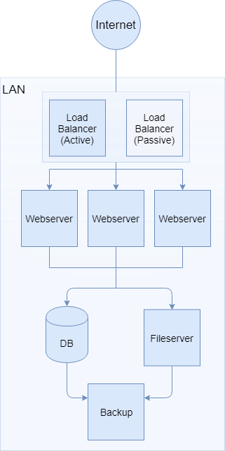
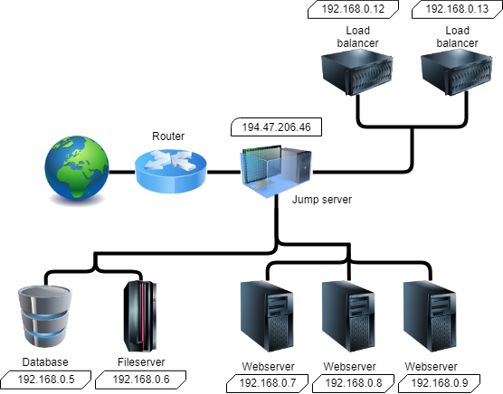

# Diagrams

### Infrastructure
This is a diagram showing the infrastructure of the system and the flow between the different components.  
Here you can see that we have two load balancers, one active and one passive. The active one is the one dealing with all the traffic incoming and the passive one is simply waiting in-case the active one would go down. If that is the case, it will change the passive one to active and all the traffic will go through there instead.  
And then we got 3 webservers, all identical to one another. The traffic is distributed evenly between the three by the loadbalancers.  
All the webservers have a database-connection to the same database, so they will be identical in contents. They also got a mounted shared folder with all the uploads, so that will be the same across the webservers.  
Lastly, there is a backup-server that takes backups every hour of the wordpress data.

### Topology
This shows the topology of the system and how the different machines are accessible from the outside via a jump machine.  
Here you can see the flow between the machines when we are provisioning the machines. No other machine than the jump machine is accessible via SSH from the internet. The rest of the machines are only SSHable from our subnet.  
  
This makes it so that there is no use for additional and different keys between the different machines and a much easier key management system for SSHing. So rather than requiring different keys for each server, you only require the one for the jump machine and it will use the same key for the other servers.  
  
This also shows the fixed IPs for the machines in our network.

# Machines & components
Below here is a list of all the types of machines we will use, showing "hardware" info about them.  
The versions of the packages may vary depending on what version of ubuntu is running.

## Load Balancer
* Ubuntu 16.04
* Nginx ver 1.14

Nginx to act as a load balancer for the webserver.  
Working with a fixed shared IP between the two load balancers.

Name | Metric
--- | ---
RAM | 512mb
HDD-Size | 10GB
VCPU | 1
Image | ae802a6e-89d0-4a6c-978a-5004ece6cf73 Ubuntu 16.04
Flavor | c1-r05-d10
Floating-IP | Yes
Ansible Role | Loadbalancer
Security group | HTTP,SSHInt,vrrp-sec-grp

## Webserver + PHP
* Ubuntu 16.04
* Apache 2.4.29
* PHP latest (min 5.2.4)

Server to handle Wordpress and PHP

Name | Metric
--- | ---
RAM | 512mb
HDD-Size | 10GB
VCPU | 1
Image | ae802a6e-89d0-4a6c-978a-5004ece6cf73 Ubuntu 16.04
Flavor | c1-r05-d10
Floating-IP | No
Ansible Role | Wordpress
Security group | SSHInt,HTTP

## DB
* Ubuntu 16.04
* MySQL latest (min 5.0.15)

Database server to communicate with the webservers.

Name | Metric
--- | ---
RAM | 512mb
HDD-Size | 10GB
VCPU | 1
Image | ae802a6e-89d0-4a6c-978a-5004ece6cf73 Ubuntu 16.04
Flavor | c1-r05-d10
Floating-IP | No
Ansible Role | Database
Security group | SSHInt,MYSQL

## Fileserver
* Ubuntu 16.04
* NFS Utils (1.2.8-9 latest)

Fileserver to be used for uploaded files for Wordpress.

Name | Metric
--- | ---
RAM | 512mb
HDD-Size | 10GB
VCPU | 1
Image | ae802a6e-89d0-4a6c-978a-5004ece6cf73 Ubuntu 16.04
Flavor | c1-r05-d10
Floating-IP | No
Ansible Role | FileServer
Security group | SSHint,NFS

## Jump machine
* Ubuntu 16.04

Jump machine to enable contact with the internal network with SSH while provisioning with Ansible.

Name | Metric
--- | ---
RAM | 512mb
HDD-Size | 10GB
VCPU | 1
Image | ae802a6e-89d0-4a6c-978a-5004ece6cf73 Ubuntu 16.04
Flavor | c1-r05-d10
Floating-IP | No
Ansible Role | Jumpmachine
Security group | SSHExt

## Monitoring
* Ubuntu 16.04

The monitoring server will check the status of each of the other servers and report system information and create failure reports.
For monitoring sensu will be used and usage of a predefined role in galaxy.

Name | Metric
--- | ---
RAM | 4GB
HDD-Size | 20GB
VCPU | 1
Image | ae802a6e-89d0-4a6c-978a-5004ece6cf73 Ubuntu 16.04
Flavor | c1-r4-d20
Floating-IP | No
Ansible Role | Monitoring
Security group | Monitor,SSHInt

## Backup

The backup server will be used to backup information used by wordpress.

Name | Metric
--- | ---
RAM | 512mb
HDD-Size | 10GB
VCPU | 1
Image | ae802a6e-89d0-4a6c-978a-5004ece6cf73 Ubuntu 16.04
Flavor | c1-r05-d10
Floating-IP | No
Ansible Role | Backup
Security group | SSHInt

## Router / Network

Name | Metric
--- | ---
Network name | ACME_network
Network Subnet  | 192.168.0.0/24
Network Gateway  | 192.168.0.1
Router name  | ACME_Router
